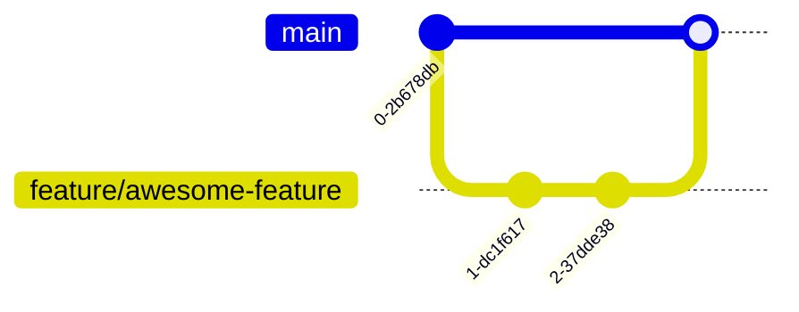

# Thalitera - Meeting Room Reservation System

[](https://www.gnu.org/licenses/gpl-3.0)

## Technology Stack

### Frontend Ecosystem
[](https://nextjs.org/)
[](https://react.dev/)
[](https://www.typescriptlang.org/)
[](https://tailwindcss.com/)
[](https://tanstack.com/query/latest)

### Backend Ecosystem
[](https://spring.io/projects/spring-boot)
[](https://spring.io/projects/spring-security)
[](https://baomidou.com/)
[](https://projectlombok.org/)
[](https://swagger.io/)

### Data Layer
[](https://www.postgresql.org/)
[](https://redis.io/)
[](https://min.io/)

### DevOps & Infrastructure
[](https://www.docker.com/)
[](https://kubernetes.io/)
[](https://nginx.org/)
[](https://prometheus.io/)
[](https://grafana.com/)
[](https://github.com/features/actions)

## Project Overview

**Thalitera** revolutionizes institutional resource management through a modern web-based reservation system. Combining enterprise-grade security with delightful UX, we deliver:

<div align="center">
  
  
  
</div>


### Core Capabilities ✨ 

| **Intelligent hub** 🧠             | **Security bastion** 🔐              | **Efficiency Engine** ⚡    |
| --------------------------------- | ----------------------------------- | -------------------------- |
| 🎯 Fast Conflict Detection         | 🔑 2FA Authentication (TOTP/SMS)     | 🚀 500ms API Response SLA   |
| 📊 Real-time Availability Heatmaps | 🛡️ End-to-End Encryption (AES-256)   | 📦 Containerized Deployment |
| 🌐 Multi-language Support          | 🔍 Audit Logging & Anomaly Detection | 🧩 Modular Architecture     |
| 🤖 Cache Integration for Queries   | 🚨 Brute Force Protection            | 🛠️ DevOps Automation        |

### Key Highlights 🌈 
- **🔒 Military-Grade Security**  
    
  Multi-layered protection with optional FIDO2 biometric authentication

- **🌍 Universal Access**  
    
  Full keyboard navigation & screen reader support

**Architecture Philosophy**:  

> "⚖️ **Balance Through Contrast**" - Where **Next.js'** fluid interactivity (⚡92 Lighthouse) meets **Spring Boot's** ironclad reliability (99.999% uptime), wrapped in **Tailwind CSS'** pixel-perfect aesthetics.

## Deployment Guide 🚀 

### Prerequisites
- Docker 24.0.6+
- Docker Compose 2.23.0+
- SSL certificates (fullchain.pem & privkey.pem)

### Step 1: Clone Repository
```bash
git clone https://github.com/Escapsule/Thalitera
cd thalitera
```

### Step 2: Prepare SSL Certificates

```bash
mkdir -p ./ssl  # Create a certificate directory.
# Rename your certificate file to:
# - fullchain.pem
# - privkey.pem
# And put it in the ssl directory.
```

### Step 3: Configure `docker-compose.yml`

```yaml
version: '3.8'

services:
  backend:
    environment:
      # Mail configuration (SMTP) 163 for example
      - MAIL_HOST=smtp.163.com
      - MAIL_USERNAME=your-email@163.com
      - MAIL_PASSWORD=your-token
      
      # your domain
      - BASE_URL=https://your-domain.com
      
      # MinIO configuration (modify according to actual deployment)
      - OSS_ENDPOINT=http://minio:9000       # MinIO access address
      - OSS_ACCESS_KEY=  
      - OSS_SECRET_KEY=    
      - OSS_BUCKET=          				# bucket name

  nginx:
    volumes:
      - ./ssl/fullchain.pem:/etc/nginx/ssl/fullchain.pem
      - ./ssl/privkey.pem:/etc/nginx/ssl/privkey.pem
```

### Step 4: Initialize `MinIO` (Required for first deployment)

1. Visit `http://your-minio-domain.com:9000` (Default port 9000)
2. Log in using the credentials which your set：
   - Access Key
   - Secret Key
3. Create a storage bucket.

### Step 5: Start the service

```bash
# Build and start a container.
docker-compose up -d --build

# View real-time logs.
docker-compose logs -f
```

>  Key configuration instructions 🔧
>
> Recommendations for `MinIO`production environment
>
> 1. **Independent deployment**: It is recommended to deploy `MinIO` on an independent server.
>
> 2. **Deploy by Docker:**
>
>    ```yaml
>    version: '3'
>    services:
>      minio:
>        image: quay.io/minio/minio
>        ports:
>          - "9000:9000"
>          - "9001:9001"
>        volumes:
>          - /data:/data
>          - ./ssl/your-domain.com.pem:/root/.minio/certs/public.crt:ro
>          - ./ssl/your-domain.com:/root/.minio/certs/private.key:ro # https needed
>        environment:
>          - MINIO_ROOT_USER=your_root_user
>          - MINIO_ROOT_PASSWORD=your_password
>          - MINIO_API_CORS_ALLOW_ORIGIN=your-domain.com # recommended to configure in the production environment.
>          - MINIO_API_CORS_ALLOW_METHODS=GET,PUT,POST,DELETE,HEAD
>          - MINIO_API_CORS_ALLOW_HEADERS=*
>          - MINIO_API_CORS_EXPOSE_HEADERS=ETag
>          - MINIO_API_CORS_MAX_AGE=3000
>        command: server /data --console-address ":9001" # web ui port
>        restart: always
>    
>    ```


# Backend Development Guide 💻 

## Prerequisites

- JDK 17+
- Maven 3.9+
- IntelliJ IDEA (2023.2+ recommended)
- Docker Desktop (for local DB)

## Setup Development Environment

```bash
git clone https://github.com/Escapsule/Thalitera
cd thalitera/thalitera-backend
```

## Create Development Configuration

- Create `application-dev.yml` at:

  ```bash
  server/src/main/resources/application-dev.yml
  ```

- Configure with your local settings:

  ```yaml
  spring:
    config:
      base-url: http://xxxxx.xxx
      activate:
        on-profile: dev # important
    datasource:
      url: jdbc:postgresql://PROD_DB_HOST:PORT/DB_NAME  # turn to your database
      username: PROD_USERNAME  # database username
      password: PROD_PASSWORD  # database password
    mail:
      host: 
      username: xxx@xxx.com
      password: abcdefghijklmnopqrstuvwxyz
      protocol: smtp
      properties:
        mail.smtp.auth: true
        mail.smtp.ssl.enable: true
        mail.smtp.connectiontimeout: 5000
        mail.smtp.timeout: 3000
        mail.smtp.writetimeout: 5000
    data:
      redis:
        host: localhost
        password:
        database: 0
  oss:
    endpoint:  # console address
    access-key: # access-key
    secret-key: # secret-key
    bucket: # bucket
    
  ```

## Initialize Database

[](https://thalitera-postgres/init/01-init.sql)

Let's assume you've already installed PostgreSQL, and Redis.

And Sql was in `thalitera-postgres/init/01-init.sql`

## Development Workflow 🔧 

### Recommended Tools 🛠️ 

[](https://www.jetbrains.com/idea/)
[](https://www.postman.com/)
[](https://redis.com/redis-enterprise/redis-insight/)

### Dependency Management 📦 

```bash
mvn clean install -DskipTests
mvn spring-boot:run -Dspring-boot.run.profiles=dev
```

### Pro Tips 💡

### Essential Plugins 🧩 

| Plugin                                                       | Benefit                        |
| :----------------------------------------------------------- | :----------------------------- |
| [](https://plugins.jetbrains.com/plugin/10229-spring-assistant) | Enhanced Spring Boot support   |
| [](https://projectlombok.org/) | Auto-generate boilerplate code |
| [](https://www.sonarlint.org/) | Real-time code quality checks  |

# Frontend Development Guide🌟 

[](https://nextjs.org/)
[](https://react.dev/)
[](https://www.typescriptlang.org/)
[](https://tailwindcss.com/)

A modern meeting room reservation interface built with Next.js App Router and modern web standards.

## 🚀 Quick Start

### Clone Repository
```bash
git clone https://github.com/Escapsule/Thalitera
cd thalitera-frontend
```

### Install Dependencies

[](https://pnpm.io/)

```bash
pnpm install
```

### Start Development Server

```bash
pnpm dev
```

Open [http://localhost:3000](http://localhost:3000/) in your browser.

### Key Optimizations

- ✅ Code splitting with dynamic imports
- ✅ Image optimization via `next/image`
- ✅ Static page generation (ISR)
- ✅ Bundle analysis with `@next/bundle-analyzer`

# Contribution Guide 🤝

## Branch Strategy



##  License Compliance

[](https://license/)

- All contributions must adhere to GPLv3
- Document third-party dependencies
- Include license headers in new files
